# treeline-app

[](https://github.com/dscanlan/treeline-app/actions/workflows/ci.yml)

A worktree-aware terminal multiplexer for macOS. One Electron window
contains both a sidebar of all your git worktrees across multiple repos
and the terminals you have open in them — so spawning Claude in a
worktree, watching `npm test` in another, and managing branches in a
third is one window, not three apps.

A reimagining of `treeline` (a Rust TUI predecessor), but where the
Rust version drives an external iTerm2 via AppleScript, this version
**hosts** its own terminals via `node-pty` + `xterm.js`.

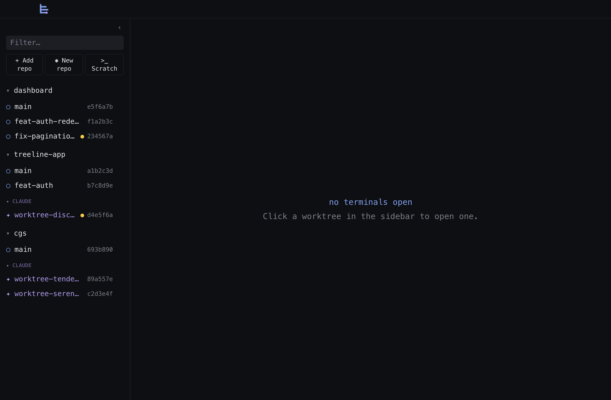

## Documentation

- **[User Guide](docs/USER_GUIDE.md)** — task-oriented walkthrough of every GUI
  workflow (add a repo, open terminals, dev servers & the browser pane, editing
  files, worktrees, theming, auto-update).
- **[CLI Guide](docs/CLI.md)** — install + every `treeline` command, JSON output
  shapes, the raw socket API, and troubleshooting.
- **[Architecture](docs/ARCHITECTURE.md)** · **[Developing & releasing](docs/DEVELOPING.md)** — for contributors.

New here? Start with the [five-minute quick start](docs/USER_GUIDE.md#five-minute-quick-start).

## Why

The driving workflow is:

1. Add a repo to the sidebar (one-time, via the native file picker).
2. Hover the repo row and click its `>_` button → a terminal tab opens
   with a shell at the repo path. (Clicking the repo *name* expands or
   collapses its worktrees.)
3. Run `claude` in that tab — Claude creates a new git worktree.
4. The sidebar auto-refreshes (`fs.watch` on `.git/worktrees`) and the new
   worktree appears within ~500ms.
5. Click the new worktree → a tab opens cd'd into it. Or hit the `+`
   in the tab bar to add a second tab on the same worktree.

You can also work directly on a branch — opening a terminal at the repo
root and running `git`, `npm`, `vim` etc. is a first-class flow; the
worktree dance is optional.

## Status

v0.22.0 — feature-complete for v1: macOS only, repos managed manually.
Open tabs are saved and offered back after a full restart, a
persistent scratchpad side panel rides alongside them, and a scoped
fuzzy quick-open (⌘⇧P) plus find-in-files (⌘⇧F) search the active repo.
Merged worktrees are greyed out in the sidebar with a "merged" badge.

## Install

### Pre-built (recommended)

Grab the latest `.dmg` from the
[Releases page](https://github.com/dscanlan/treeline-app/releases). A
single **universal** `.dmg` runs natively on both Apple Silicon and
Intel Macs — no second download to pick between. Builds are signed with
a Developer ID Application cert and notarized by Apple, so a plain
double-click just launches — no Gatekeeper prompts, no `xattr` dance.

> If you're still on the unsigned **v0.1.0** download, Gatekeeper will
> block it with a *"Not Opened — Apple could not verify…"* dialog whose
> only buttons are **Done** and **Move to Bin**. Either upgrade to
> v0.2.0+, or strip the quarantine flag from a terminal:
>
> ```bash
> xattr -dr com.apple.quarantine /Applications/treeline-app.app
> ```

### From source

```bash
git clone https://github.com/dscanlan/treeline-app.git
cd treeline-app
npm install              # also auto-rebuilds node-pty against Electron's ABI
npm run dev              # launches the app with HMR for the renderer
```

To make your own packaged build:

```bash
npm run package:mac
open release/mac-universal/Treeline.app
```

For a quick demo with pre-loaded fixture repos:

```bash
./scripts/launch-with-test-scenario.sh
```

This creates three pretend projects with multiple worktrees (some dirty,
some Claude-style), launches the dev build pointed at them, and cleans
up on exit.

## Tour

> The sections below are a feature overview. For step-by-step GUI workflows see
> the **[User Guide](docs/USER_GUIDE.md)**.

### Sidebar

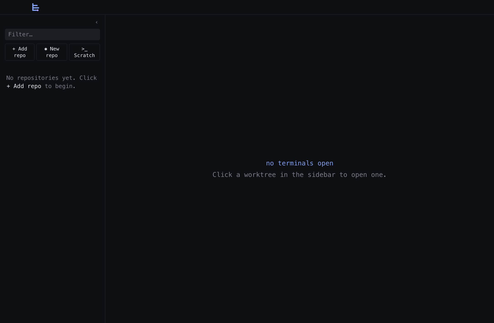

| Action                          | Where                                                   |
| ------------------------------- | ------------------------------------------------------- |
| Add an existing repo            | `+ Add repo` button (native picker)                    |
| Create a new repo               | `✱ New repo` button (modal — `git init` in a new or empty folder) |
| Open a scratch terminal         | `>_ Scratch` button (shell in your home directory, no repo) |
| Filter worktrees by branch/path | `Filter…` input above the repo list                    |
| Open repo root in a new tab     | `>_` icon on hover (next to the repo name)             |
| Browse a worktree's files       | folder icon at the left of a worktree row (toggles the file tree) |
| Create a worktree               | `+` icon on hover (next to the repo name)              |
| Remove a repo from the sidebar  | `×` icon on hover (the repo's data is untouched)       |
| Delete a worktree               | `×` icon on hover (next to a worktree row)             |
| Collapse/expand the sidebar     | `‹` / `›` button in the title bar, or `⌘B`             |

Each worktree row shows: the branch name, short SHA, a yellow `●` if the
working tree is dirty, a colored status dot for any open tabs on that
path (green = running, cyan = idle, dim = exited), a magenta `claude`
/ `opencode` / `aider` badge if one of those CLIs is currently in that
worktree, a dim cyan `:PORT` chip for each TCP port a process rooted
in that worktree is listening on, and a `#NNN` badge for the branch's
linked GitHub PR (colored by state, with a CI checks glyph).

Claude-managed worktrees (paths under `.claude/worktrees/` or branches
starting with `worktree-`) get a magenta `✦` icon and are grouped into
their own `✦ Claude` sub-section per repo, mirroring the Rust TUI's
visual treatment.

#### Listening ports

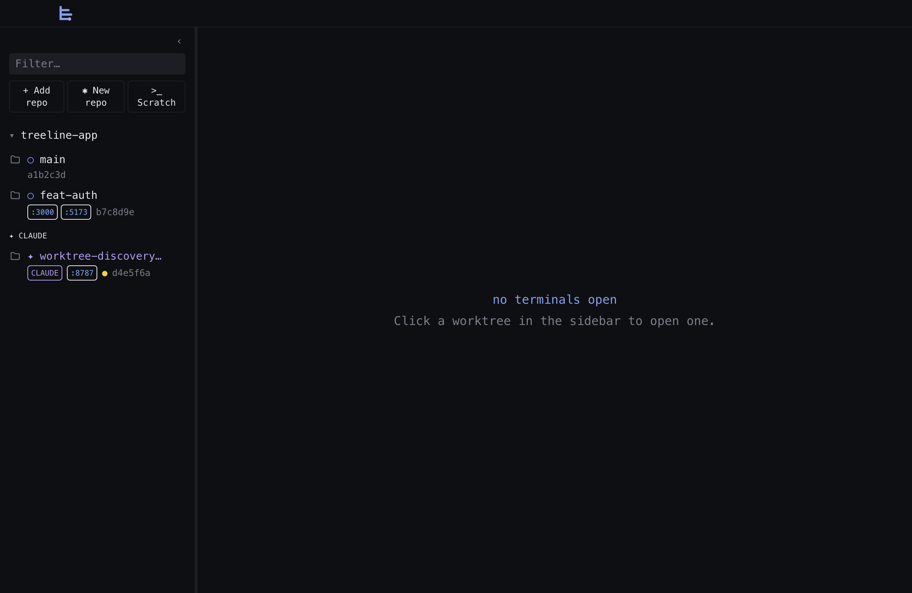

A background `lsof -iTCP -sTCP:LISTEN` pass (folded into the same 2s
process scan) finds every listening TCP socket, resolves the owning
process's working directory, and attributes the port to a worktree by
the same longest-path-prefix match used for the `claude`/`opencode`/`aider`
badges. So when a dev server, test runner, or preview boots inside a
worktree, its `:5173` shows up on that row — and disappears when the
process exits — without you running `lsof` yourself. Ports are deduped
and sorted, and attribution is by the listener's **cwd**, so a server
launched outside treeline still appears as long as it's rooted in the
worktree.

Each `:PORT` chip is a **button**: click it to open
`http://localhost:<port>` in the [embedded browser](#browser) pane — the
"run your server → click the port → see your app" loop, no address bar
typing. (It's the same store action the scriptable `treeline browser
navigate` verb drives.)

#### Linked PR status

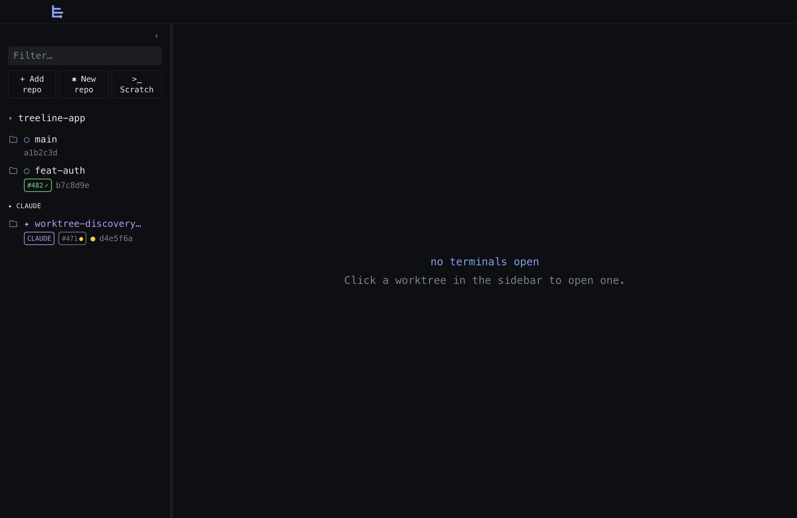

A worktree's real status often lives on GitHub — is there an open PR for
this branch, is CI green, is it merged? A background poll runs the
[`gh` CLI](https://cli.github.com) (`gh pr list`) per repo and shows the
branch's linked PR right on its row: the PR number colored by state
(**green** open · **dim** draft · **magenta** merged · **red** closed)
plus a CI rollup glyph (**✓** passing · **✗** failing · **●** pending).
Click the badge to open the PR in your browser. It refreshes on a 60 s
cadence and whenever the worktree set changes, so a freshly-opened PR or a
flipped CI run shows up on its own.

This reuses your existing `gh` auth — no token to configure — and degrades
silently: no `gh`, not authenticated, no GitHub remote, or offline just
means no badge (everything else works unchanged).

### Terminals

Terminals are real PTYs spawned in the main process via `node-pty` and
rendered with `xterm.js` (WebGL renderer, FitAddon, WebLinks, Search).

- **Click a worktree** → focus the most-recently-used tab for that path,
  or open one if none exists.
- **Click `+` in the tab bar** → open an *additional* tab on the
  selected sidebar item, even if one already exists. Useful for keeping
  one tab running `claude` and another tab on the same repo for actual
  work.
- **Click the `>_` icon on a repo node** → opens a fresh tab at the
  repo root. Same as `+` but doesn't require selecting first.
- **Click a tab's `×`** → closes the tab, kills its PTY (SIGHUP, then
  SIGKILL after 200 ms), and falls back to the next-MRU tab on the same
  worktree if any.
- **Drag a tab** along the tab strip to reorder it; a short click still
  selects (the drag only engages past a small threshold).
- **Click a link in terminal output** → a local dev-server URL (e.g. the
  `http://localhost:5173/` Vite prints) opens in the [embedded
  browser](#browser) pane; any other URL opens in your OS browser.

Terminals stay mounted (consuming PTY data into their scrollback) when
not visible, so switching back is instant — no replay flicker.

### Split panes

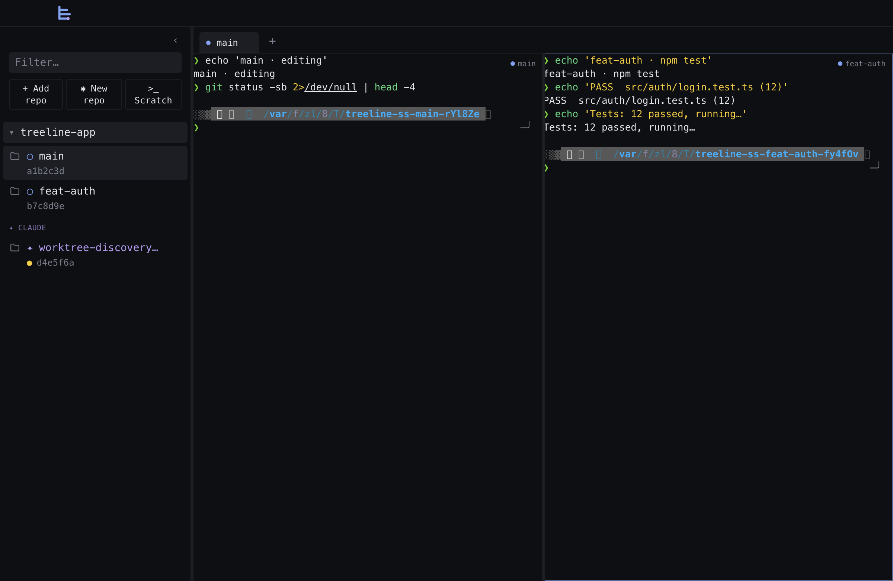

A single tab isn't one terminal — it's a *tree* of terminal panes, so you
can watch `claude` work, tail `npm run dev`, and keep a free shell side by
side without juggling tabs. Each pane is its own PTY with its own xterm,
status dot, and process badge; splitting never reshuffles what's already
running.

- **`⌘D`** splits the focused pane to the **right**; **`⌘⇧D`** splits it
  **down**. Splitting along the axis a pane is already arranged on slices the
  new pane in beside its siblings; splitting across the axis wraps the focused
  pane in a fresh nested split (the cmux model), so any grid is reachable.
- **`⌘⌥ + ← / → / ↑ / ↓`** moves keyboard focus to the neighbouring pane in
  that direction (the bare arrows still go to the shell). The focused pane is
  the one with the cyan ring; it's where new splits and keystrokes land.
- **`⌘⇧W`** closes the focused pane, kills its PTY, and collapses the split —
  a split that drops to a single child becomes that child again, and closing
  the last pane closes the tab.
- **Drag a divider** between panes to resize; the terminals re-fit to their new
  rectangles. Panes — like tabs — stay mounted when their tab is hidden, so
  output keeps flowing into the scrollback.

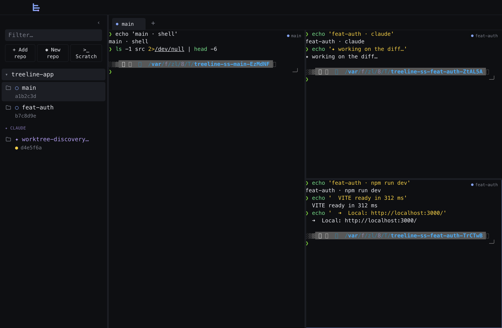

### Sessions survive a reload

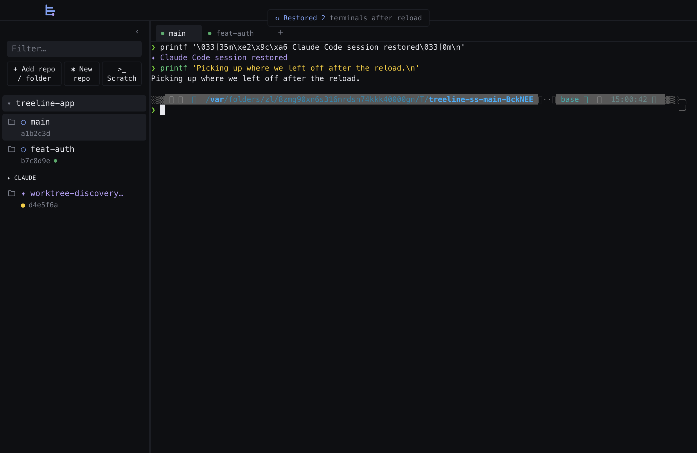

Terminals live in treeline's background process, not in the window, so a window
**reload** (`⌘R`) doesn't take them down with it. treeline **re-adopts the PTYs
that were still running** rather than orphaning them, shows a brief
**"↻ Restored N terminals"** toast, and nudges each pane so a running TUI (a
`claude` session, a `npm test` watcher) repaints where you left it. Your agents
and long-running commands keep running across the reload instead of being
silently killed or stranded as invisible orphan shells. (Each surviving terminal
returns as its own tab.)

A reload keeps the background *process* alive. A full restart that ends that
process — an **auto-update relaunch** or a **reboot** — leaves no shells to
re-adopt; that case is handled by
[session restore](#tabs-come-back-after-a-full-restart) below.

### Tabs come back after a full restart


When treeline's background process itself ends — it **auto-updates and relaunches**,
or your **machine reboots** — the terminals are gone for real, so re-adopting
isn't possible. Instead treeline keeps the **tab layout saved to disk** and, on
the next cold launch, offers to bring it back: a **"Restore previous session?"**
prompt. Nothing respawns until you say so.

Choose **Restore** and treeline rebuilds the session: one fresh shell per pane in
its original folder, the **full split layout** intact (not flattened), and any
pane that was running an **agent** picks its conversation back up via that
agent's own resume command (`claude --resume`, `opencode --session`,
`aider --restore-chat-history`). A **"↻ Restored N tabs"** toast confirms it. Tabs whose
worktree was deleted while the app was closed are skipped, and the toast says how
many. (Scrollback from before the restart isn't replayed — a fresh shell starts
at a clean prompt, and a resumed agent repaints its current view.)

### Agent attention notifications

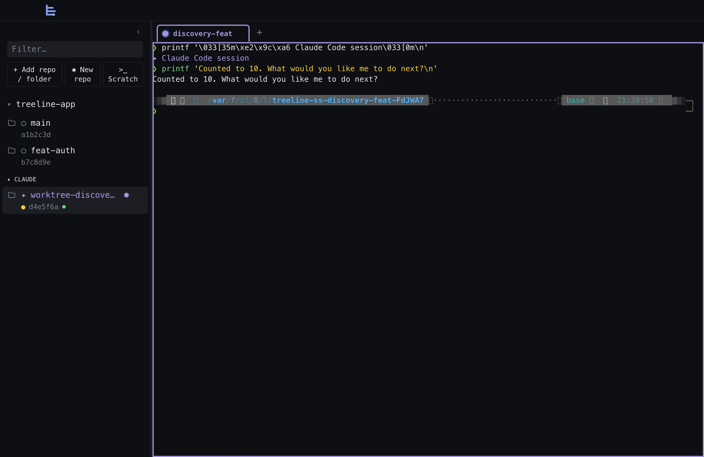

When an agent in a terminal needs you — it finished, or it's asking for input —
the pane gets a magenta ring, its **tab** turns into a pulsing magenta *waiting*
tab, and the worktree's **sidebar row** gets an unread dot (plus a native
notification when the window is backgrounded). **`⌘⇧U`** jumps to the
most-recently-waiting pane; focusing a pane clears it. treeline picks this up
from **OSC&nbsp;9 / 99 / 777** terminal escape codes, or — for Claude Code, which
emits none — from its `Stop`/`Notification` hooks via
[`treeline hooks setup`](docs/CLI.md#agent-hooks). See the
[User Guide](docs/USER_GUIDE.md#knowing-when-an-agent-needs-you).

### Code viewer

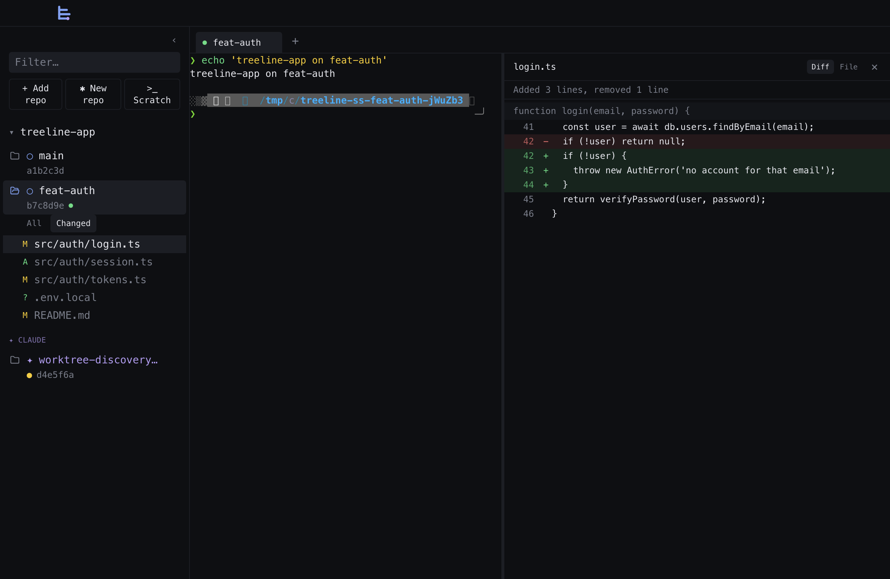

You're mostly in the terminal, but sometimes you just need to *look* at a
file — peek at an `.env`, re-read a config, glance at a function. The code
viewer does that without leaving treeline or breaking your terminal flow.

- **Click the folder icon** at the left of a worktree row to expand its
  **file tree**. Directories load lazily (one level per expand) and `.git`
  is hidden; the icon is a folder, not a chevron, so it reads distinctly
  from the repo's expand/collapse triangle one level up.
- **`All | Changed` toggle** at the top of the expanded area. **Changed**
  swaps the tree for a flat list of the worktree's working-tree changes
  (`git status`), each tagged with a colored status letter:

  | Letter | Meaning   | Color  |
  | ------ | --------- | ------ |
  | `M`    | modified  | yellow |
  | `A`    | added     | green  |
  | `?`    | untracked | green  |
  | `D`    | deleted   | red    |
  | `R`    | renamed   | cyan   |
  | `U`    | conflicted | red   |

  Deleted entries are shown struck-through and aren't clickable. The list
  refreshes off the same `.git` watcher that drives the dirty dot, so it
  updates on commits and git operations and re-polls every ~5 s — a plain
  file save may take a moment to show rather than appearing instantly. (Re-
  toggling **All → Changed** forces an immediate refetch.)
- **Click a file** → it opens in a read-only, syntax-highlighted **panel
  that splits in beside the terminal**, so you can reference code and keep
  working in the same view. Language is picked from the file extension
  (`.env` and unknown types render as plain text).
- **Diff view.** Clicking a file in the **Changed** list opens its **diff**
  (working tree vs `HEAD`): a unified view with a per-file summary, line
  numbers, and red `-` / green `+` rows. Untracked files render as all
  additions. The panel header has a **`Diff | File`** toggle to flip the
  open file between its diff and full contents.
- **Markdown preview.** Markdown files (`.md`, `.markdown`, `.mdx`) open on
  a rendered **Preview** instead of raw source — headings, lists, tables,
  task lists, blockquotes, links, and syntax-highlighted code fences, all
  in the app's palette (GitHub-Flavored Markdown). The header shows a
  **`Preview | Diff | File`** toggle; switch to **File** for the raw source
  (and to edit it). Links open in your browser; embedded raw HTML and
  remote images are not rendered (the app's content policy blocks them).
- **Editing.** The File view is read-only until you click **Edit** in the
  panel header, then it becomes editable. Save with **⌘S** (or the Save
  button); an amber dot by the filename marks unsaved changes, and writes
  are atomic (temp file + rename). After a save, the diff and **Changed**
  list refresh. Switching files or closing the panel with unsaved edits
  prompts first. Truncated (>1 MB) and binary files stay read-only.
- **Drag the divider** between the terminal and the panel to resize; the
  terminal re-fits to the new width. The `×` in the panel header closes it.

Guard rails keep it snappy: files over 1 MB are shown truncated (with a
`truncated` badge), and binary files (detected by a NUL byte) show a
placeholder instead of mojibake.

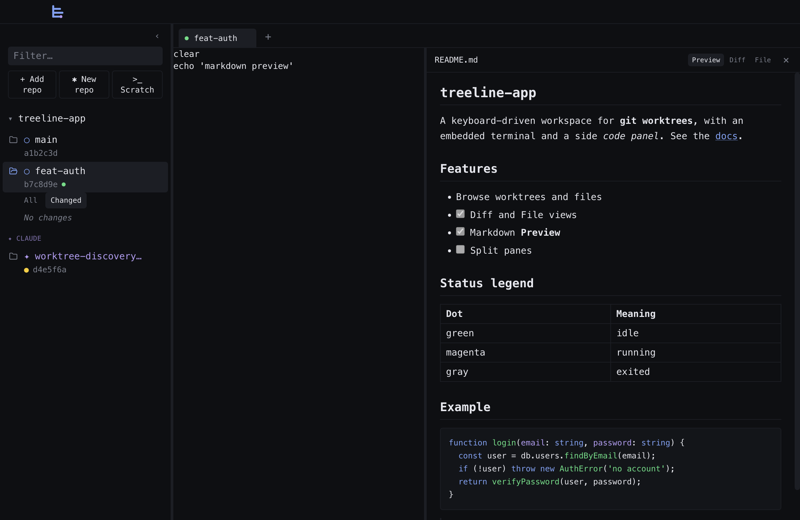

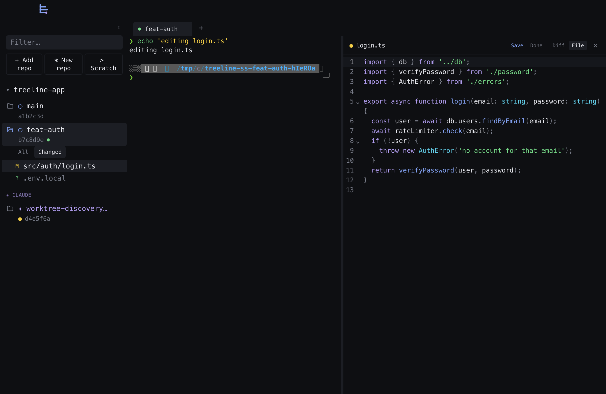

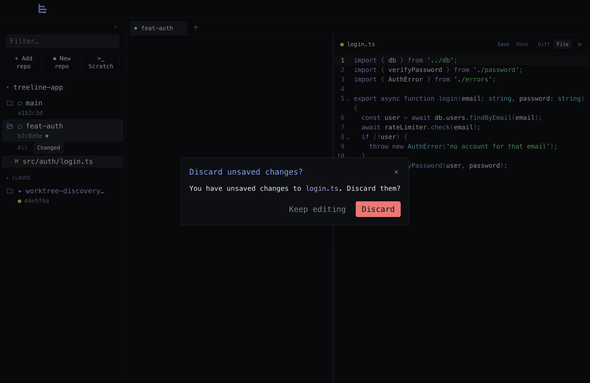

### Open folders (non-git)

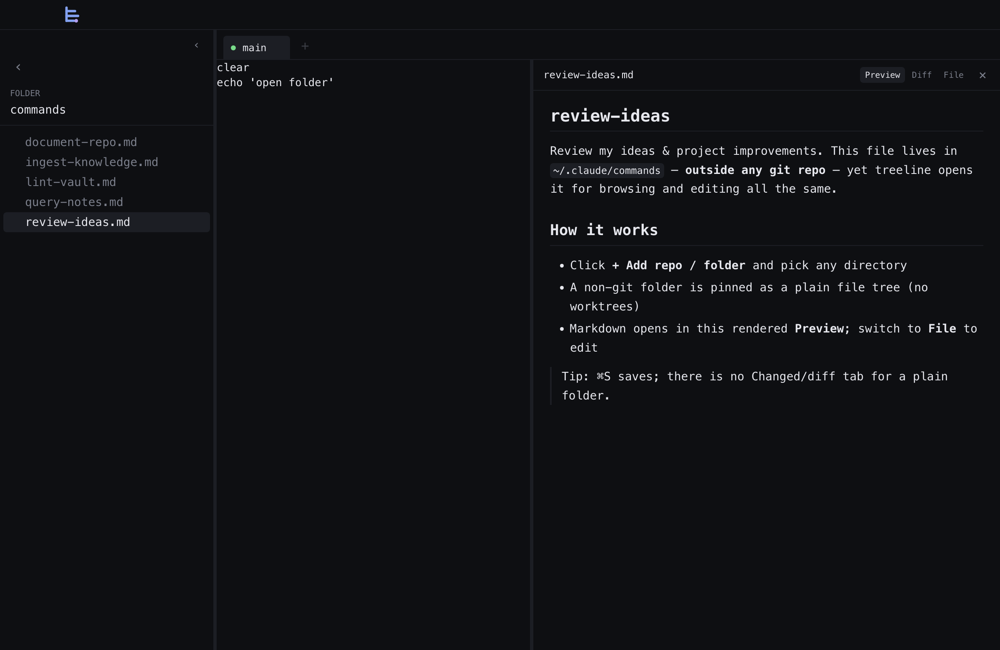

Not everything you want to read or edit lives in a git repo — dotfiles, a
notes directory, `~/.claude/commands`. **Add repo / folder** accepts those too:
pick any directory and, if it isn't a git repo, treeline pins it as a plain
**folder** root.

- **One button, two outcomes.** Click **+ Add repo / folder** and pick a
  directory. A git repo (or any path inside one) is added as a repo with its
  worktrees, exactly as before; anything else is pinned as a folder.
- **A bare, editable file tree.** A folder appears as a top-level node (folder
  glyph, below your repos) that expands straight into the same lazy file tree —
  click files to view, **Edit** + **⌘S** to save. The whole code viewer
  (syntax highlighting, Markdown preview) works unchanged.
- **No git, no git UI.** Folders have no worktrees and no **`All | Changed`**
  toggle or diff view — those are git-only. Saving a file in a folder just
  writes it; there's nothing to diff against.
- **Persists across restarts**, alongside your repos. The **`×`** on the folder
  row unpins it (the files on disk are untouched); **`>_`** opens a terminal
  there.

Editing existing files only — creating brand-new files from the tree isn't
supported yet. (A directory that sits *inside* a git repo is detected as that
repo, not added as a plain folder.)

### Search (files & contents)

Find code without leaving the window. Both surfaces are **scoped to the selected
worktree/folder** (or, with nothing selected, the focused terminal's cwd), are
powered by [ripgrep](https://github.com/BurntSushi/ripgrep) (bundled — no install),
and respect `.gitignore` in git repos and plain folders alike.

- **`⌘⇧P` — Quick Open File** (*View → Quick Open File…*). A fuzzy filename finder:
  type any part of a path, `↑`/`↓` to move, `Enter` to open in the code panel,
  `Esc` to dismiss. Matched characters are highlighted.
- **`⌘⇧F` — Find in Files** (*View → Find in Files…*). A results panel on the right
  lists matches grouped by file (line number + highlighted hit) as you type;
  clicking a result opens that file **at the matched line**. Toggle **`Aa`** (match
  case), **`ab`** (whole word), and **`.*`** (regex; literal text by default).

Both accelerators are rebindable under **Settings → Keybindings**.

### Browser

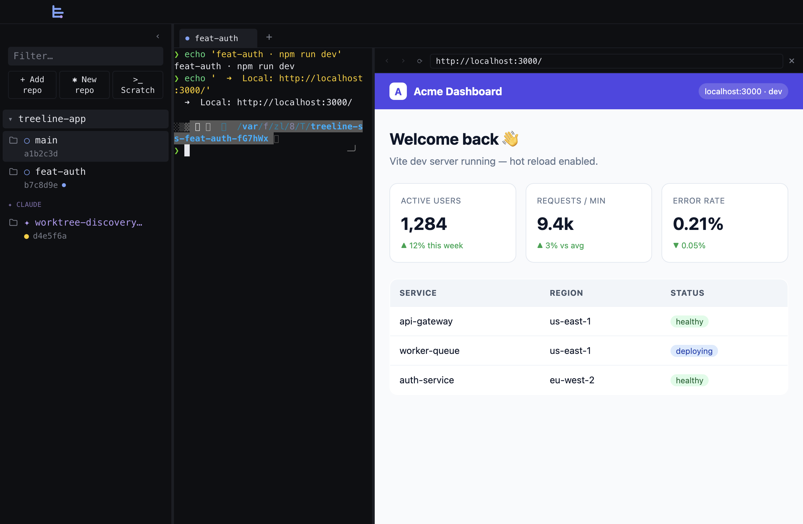

Press `⌘⇧B` (or **View → Toggle Browser**) to split an **embedded browser**
in beside the terminal — view the dev server you're running in a worktree
without alt-tabbing to Safari/Chrome and hunting for the port.

- **Address bar** with **back / forward / reload** and a loading indicator.
  Type a URL and hit Enter; a bare host (`localhost:3000`, `127.0.0.1:8080`)
  is assumed `http://`, and non-web schemes (`file:`, `javascript:`, …) are
  refused. The pane opens pointed at `http://localhost:3000` by default.
- **Real Chromium, not an iframe** — it's an Electron `<webview>` with its own
  isolated session (`persist:treeline-browser`). The guest runs with no node
  integration and no preload; links that try to open a new window are handed to
  your OS browser (web/mail schemes only), mirroring the terminal's link policy.
- **Drag the divider** on the pane's left edge to resize (the terminal re-fits);
  the `×` in the header closes it.

The pane is also **scriptable** — the `treeline browser …` CLI verbs let an agent
in a worktree terminal navigate it, read the page, and click/type into it, so it can
*act on its own change and verify the result*. See [Driving the browser (the agent
loop)](#driving-the-browser-the-agent-loop) below.

### Scratchpad

Press `⌘⇧N` (or **View → Toggle Scratchpad**) to open a **scratchpad** — a single,
always-available plain-text buffer beside the terminal, for the quick
**paste → clean → copy** loop: drop a messy block an agent printed, delete the
irrelevant lines, and copy the clean result into another chat — without leaving the
app for a text editor.

- **Copy** in the header puts the whole buffer on the clipboard; **Clear** wipes it
  (click again to confirm — it deletes saved content); `×` closes the panel.
- **Drag the divider** on the pane's left edge to resize (the terminal re-fits).
- **Persistent.** The text is saved to `scratchpad.json` and restored across renderer
  reloads and full restarts (flushed on edit, on blur, and on window close).
- It **shares the right-hand slot with the [browser](#browser)** — opening one closes
  the other, so the terminal is never squeezed by a third panel.

### Settings & theming


Open **Settings** with `⌘,` (or the **treeline → Settings…** menu item). It's
a single modal with three sections:

- **Appearance — theme.** Pick a preset (**Graphite Dark**, **Graphite Light**,
  **Midnight**). The theme drives the whole app, not just the terminals: the
  nine palette slots resolve to CSS variables, so switching repaints the sidebar,
  tabs, panels and badges *and* re-themes the xterm instances live — no reload.

  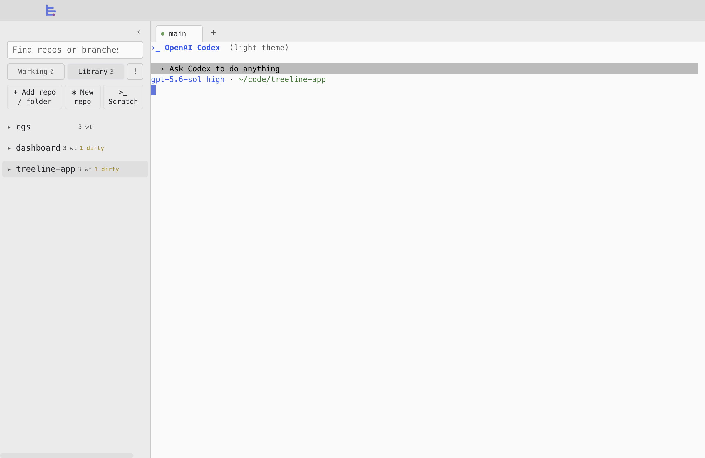

  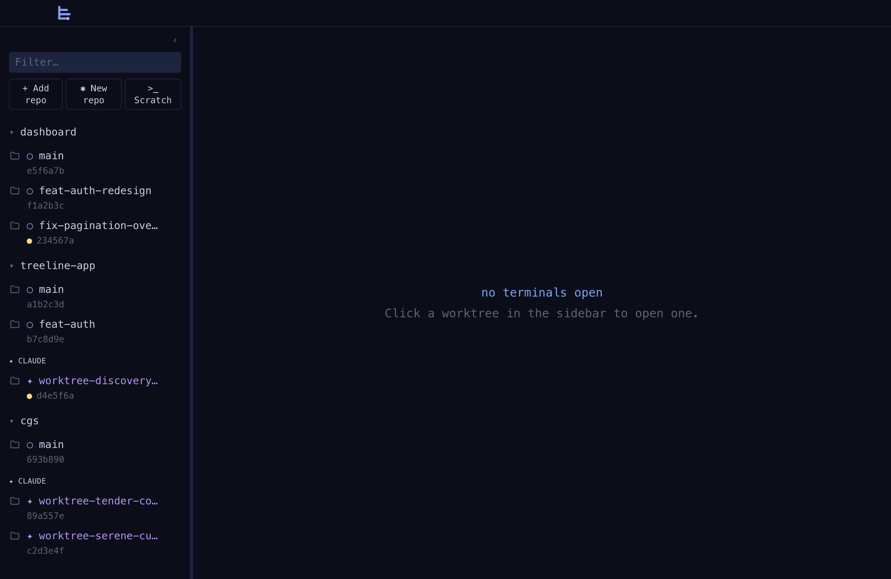

- **Terminal — font.** Set the monospace **font family** and **size**; the whole
  app renders in it (the UI is monospace by design) and the terminals re-fit in
  place. Importing an external terminal config (Ghostty / iTerm2) is stubbed as
  "coming soon".
- **Keybindings.** Rebind the app's own accelerators in Electron accelerator
  syntax. Bindings are validated as you type: a chord used by two commands, or
  one that collides with a **reserved system shortcut** (Paste, Copy, Quit, …),
  turns the field red, explains itself inline, and disables **Save** until you
  fix it. Saving rebuilds the menu immediately, so a new accelerator works
  without restarting.

  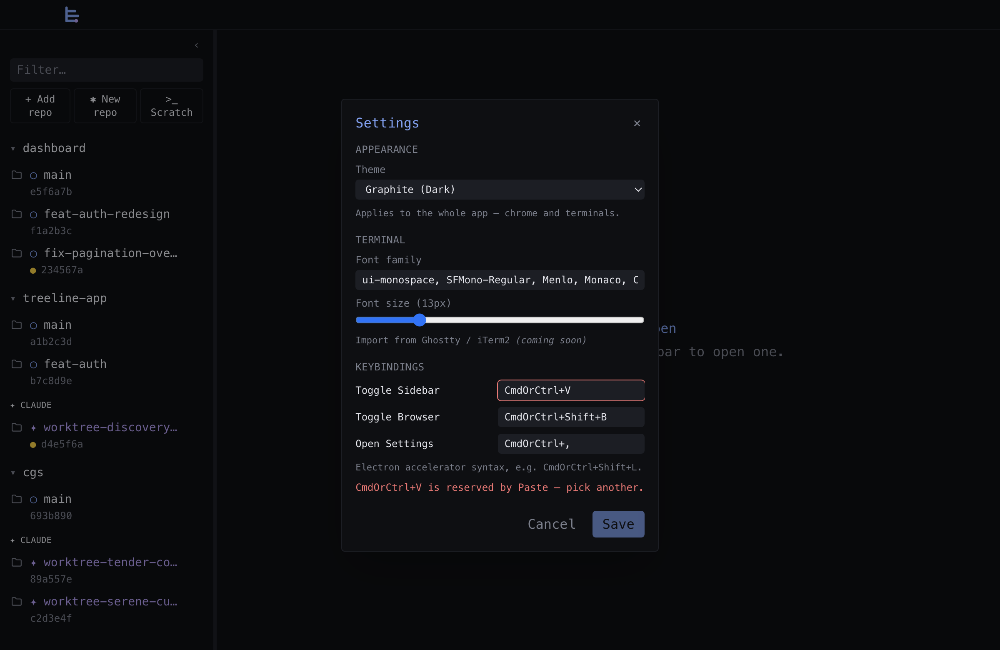

Everything persists to the app config (`schemaVersion` 4); an older config is
migrated forward with the new defaults filled in.

### Scriptable CLI

> Full reference — install, every command, JSON output shapes, the raw socket
> protocol, and troubleshooting — is in the **[CLI Guide](docs/CLI.md)**.

The running app exposes a `treeline` CLI (and a raw socket API) so scripts and
agents — not just the mouse — can drive it. The app's main process listens on a
**user-scoped unix domain socket** (under its `userData` dir, `0600`, never bound
to a network interface); the CLI is a thin client that sends one newline-delimited
-JSON command and prints the reply. Verbs route through the same services the GUI
uses, so behaviour can't drift between mouse and script.

```bash
treeline ping                      # health check
treeline repos                     # tracked repos (JSON)
treeline worktrees <repo>          # a repo's worktrees (JSON)
treeline open <repo> [branch]      # focus, or open, that worktree's terminal tab
treeline send 'npm test\n'         # type keystrokes into the focused terminal
treeline notify "build finished"   # native desktop notification from the app

# Drive the embedded browser pane (see "the agent loop" below)
treeline browser navigate <url> [--wait]   # open the pane at <url> (--wait: until loaded)
treeline browser snapshot                  # compact accessibility tree of the page
treeline browser query <selector>          # inspect the first CSS match (or null)
treeline browser eval  <js…>               # run JS, print the result  (local origins)
treeline browser click <selector>          # synthetic click an element (local origins)
treeline browser fill  <selector> <text…>  # type into a field         (local origins)
treeline browser screenshot [path]         # capture the pane (PNG file, else data URL)
```

The CLI is a self-contained Node script (`bin/treeline.mjs`) that
**ships inside the packaged `.app`** — no source checkout needed:

- **Inside Treeline's own terminals**, nothing to install. On startup the app writes
  a `treeline` shim under `userData/bin` and prepends that dir to every spawned
  terminal's `PATH`, so an agent in a tab can just call `treeline …`. The shim runs
  the bundled client through the app's own Electron (`ELECTRON_RUN_AS_NODE`), so no
  system Node is required.
- **Outside the app** (e.g. Terminal.app), run **Treeline → Install Command Line
  Tool…** to symlink the shim into `/usr/local/bin`.
- **From a source checkout**, symlink `bin/treeline.mjs` onto your `PATH`, or let
  `treeline hooks setup` do it.

`treeline hooks setup [--agent <kind>]` also wires **agent** hooks (default:
Claude Code): for Claude it adds `Stop` and `Notification` entries to
`~/.claude/settings.json` that call an internal `notify-hook`, turning *"Claude
finished / Claude needs input"* into a desktop ping from the running app; for
codex (`--agent codex`) it wires the `notify` key in `~/.codex/config.toml` the
same way (`treeline hooks remove` reverses either). The hooks point at the
stable shim so they survive app updates, and never block the agent — if the app
is down they exit cleanly without a notification. See [docs/CLI.md](docs/CLI.md)
for the full per-agent support matrix.

> Notifications are delivered by macOS only from a **signed packaged build**; the
> unsigned `npm run dev` binary is denied by the OS (`UNError 1`). The socket,
> `open`, and `send` work in dev regardless.

#### Driving the browser (the agent loop)

The `treeline browser …` verbs turn the [embedded pane](#browser) into a surface an
agent can **act on and then verify** — the reason the pane exists. An agent working
in a worktree terminal can change code, drive its own dev server in the pane, and
read back the result without a human in the seat:

```bash
# 1. point the pane at the dev server and wait for the page to settle
treeline browser navigate http://localhost:5173 --wait
# 2. orient — what's on the page? (compact role/name accessibility tree)
treeline browser snapshot
# 3. exercise the UI like a user
treeline browser fill  "#email" "agent@treeline.dev"
treeline browser click "#save"
# 4. verify the change took
treeline browser snapshot                       # did the expected state appear?
treeline browser screenshot ./after.png         # … or diff the pixels
```

**`navigate` is the linchpin of design-driven UI work.** The intended loop when you
hand an agent a design (a mock, a Figma export, a screenshot) is:

> **edit the component → `navigate --wait` to the dev server → `screenshot` →
> compare against the design → adjust → repeat.**

Because `--wait` only resolves once the page has finished loading on the target
origin, the screenshot the agent compares is never a half-rendered frame — the
act-then-look cycle doesn't race the rebuild. With a hot-reloading dev server the
agent often doesn't even re-`navigate`; it just `screenshot`s after each edit and
keeps closing the gap to the design. `snapshot`/`query` give it the structural read
(roles, names, which selector matches) when a pixel diff isn't enough to know
*what* to change.

**Safety — local origins only.** `navigate`, `snapshot`, `query`, and `screenshot`
work against any page (they only read or point the pane). The verbs that *act* —
`eval`, `click`, `fill` — are refused unless the pane is on a **local** origin
(`localhost` / `127.0.0.1` / `[::1]`):

```
$ treeline browser click "a"          # while the pane is on https://example.com
treeline: scripting blocked: non-local origin (example.com)
```

So an agent can script the dev server you asked it to build, but not some
logged-in remote tab you happened to leave open in the pane. Under the hood the
acting verbs drive a real Chromium guest over the DevTools Protocol — `click` is a
synthetic mouse event at the element's centre, `fill` focuses and types — so they
exercise the same input path a user would, not a DOM shortcut.

### Scratch terminals

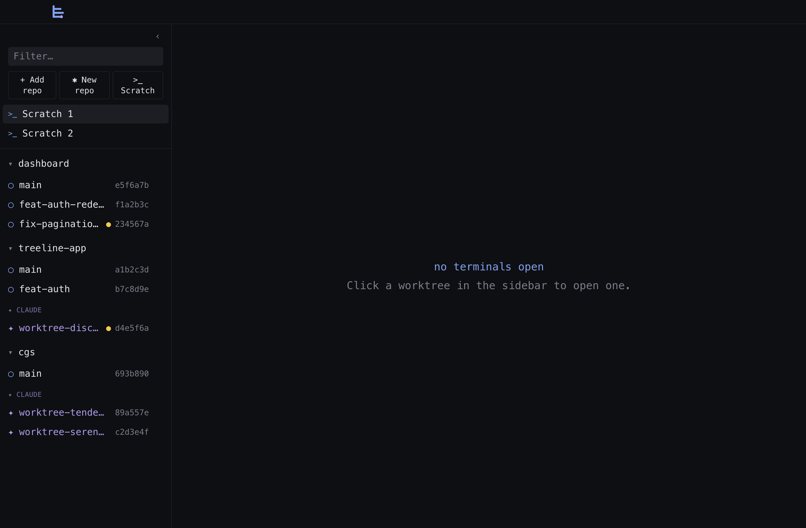

Sometimes you want a shell that isn't tied to a repo — to poke at
`~/Downloads`, run an ad-hoc script, or just type `man tar`. Click
`>_ Scratch` and a new auto-numbered terminal (`Scratch 1`, `Scratch 2`,
…) spawns in your home directory and pins itself above the repo list.
They're ephemeral: closing the tab (or typing `exit`) removes the
sidebar row, and quitting the app drops them entirely — no persistence,
no surprises on the next launch.

If a scratch terminal `cd`s into a tracked repo's path, the regular
status indicators light up the same way they would on any tab. And if
it lands inside an *untracked* repo, the discovered-repo toast still
fires — promote it to the sidebar in one click.

### Create a new repo

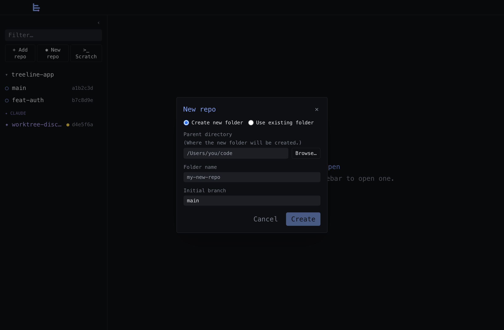

Click `✱ New repo` to skip the `mkdir foo && cd foo && git init`
shell dance. Pick whether you want to create a fresh folder or
initialize an existing empty one, choose where it lives, set the
initial branch (`main` by default), and treeline runs `git init -b
<branch>`, registers the repo in the sidebar, expands it, and drops
you into a terminal at the root — ready to start committing.

Validation is strict: a "create new" target can't already exist, and an
"existing folder" target must be a directory that isn't a repo yet and
contains no files (the macOS `.DS_Store` Finder artifact doesn't
count). Errors render inline in the modal so a wrong pick doesn't lose
the rest of your input.

### Create / delete worktrees

The create dialog auto-fills the path as `<repo>/<branch>`. If the
branch already exists, the underlying git call falls back to
`git worktree add <path> <branch>` (no `-b`), so re-creating a worktree
after deleting its directory just works.

The delete dialog warns you about open tabs that will close, then runs
`git worktree remove --force <path>`. Tabs are closed before the path
disappears so xterm doesn't keep talking to a vanished cwd.

### Worktree handoff prompt

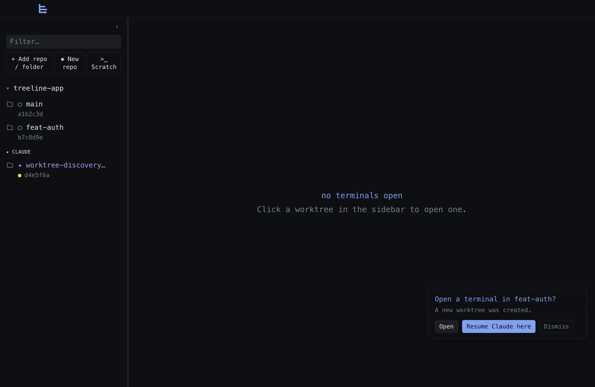

When a new worktree appears — typically because an agent ran
`git worktree add` from inside a hosted terminal — treeline offers to
**continue the Claude conversation** there, via a **Continue Claude in
new tab** button. Without this, the original tab keeps running in `main`
and the work _looks_ like it's happening there, even though the new
branch lives elsewhere. **Dismiss** clears the prompt. The trigger is
worktree _creation_, so it fires for the agent flow where no shell `cd`
ever actually happens — the `claude` process stays rooted in `main` the
whole time.

The same detection also fires (with a `↗` chip on the affected tab) when a
terminal's working directory _drifts_ into a different worktree from the
one it started in — e.g. you type `cd ../other-worktree` in the shell
yourself. There's no fresh conversation to hand off in that case, so the
toast instead offers a plain **Open** — a shell in the drifted-into
worktree, or focus of the existing tab if you already have one. A worktree
you already have a terminal open in is never prompted about. First sighting
of each worktree at launch is seeded silently, so neither startup nor
adding a repo nags you — only worktrees that appear mid-session do.

### Resume the Claude session in the worktree

When the prompt fired because a worktree was _created_, its action —
**Continue Claude in new tab** — does more than open a blank shell: it
**continues the same Claude conversation** inside the new worktree.

Claude Code stores each conversation's transcript under a folder keyed by
the directory it ran in, so `claude --resume` launched from a worktree
can't normally see a session started in the repo's main checkout. Treeline
bridges that: it finds the parent repo's most-recent Claude session, copies
its transcript into the worktree's project folder, opens a terminal there,
and runs `claude --resume <id> --fork-session`. The forked session gets its
own id, so the original transcript is never altered.

What carries over is the **conversation** — every prompt, reply, tool call
and its output. What does _not_ carry over is the **filesystem and runtime**:
the worktree is its own checkout, so uncommitted edits from the main repo
aren't present, no processes are still running, and per-session sidecars
(like the to-do list) don't follow. The resumed agent remembers what was
discussed; it should re-check the worktree's actual files before continuing.

**The original session is paused, not duplicated.** Because resuming
re-instates whatever the conversation was mid-doing, leaving the original
running would give you _two_ agents working the same task. So on handoff
treeline freezes the origin pane — `SIGSTOP` on its whole process subtree
(shell + agent + children), a real stop, not just a focus change — so only
one copy is ever active. The frozen pane shows a **Session paused** overlay
— a solid card over a dimmed, blurred terminal so it stays legible against
whatever scrollback sits underneath — naming the worktree the conversation
moved to and offering the two ways forward:

- **Keep working in `<worktree>` → close this tab** — the usual choice once
  you've committed to continuing in the worktree. It closes the now-redundant
  origin tab (reaping the frozen process) and leaves the worktree fork
  running untouched.
- **Return to original (discards worktree session)** — the undo. It thaws
  the origin (`SIGCONT`) and closes the worktree fork, so work resumes where
  it left off and the fork is thrown away.

Either way the pair stays consistent, and closing the worktree fork tab
directly also un-freezes the origin — so a parked process can never be
stranded.


This is entirely opt-in — if you never press **Continue Claude in new tab**,
nothing is copied and nothing is paused; the original session just keeps
running.
Parking targets the most-recent pane rooted at the parent repo, so run
`claude` in a hosted treeline terminal (not one outside the app) for the
pause to find it.

### Sidebar collapse

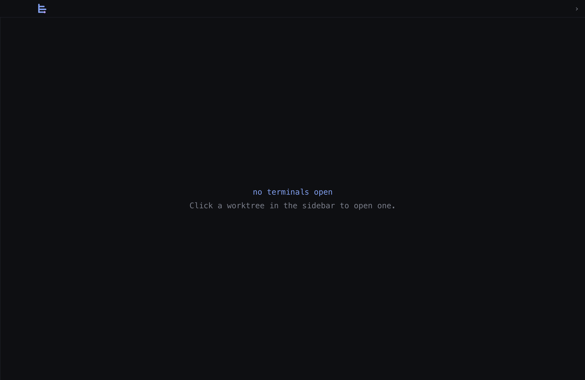

`⌘B` (or the `‹` button in the title bar) hides the sidebar entirely.
The terminal re-fits to the new width on the next animation frame.
Collapse state persists across launches via the app config.

## Keyboard shortcuts

| Shortcut       | Action                                  |
| -------------- | --------------------------------------- |
| `⌘B`           | Toggle sidebar                          |
| `⌘⇧B`          | Toggle browser pane                     |
| `⌘D`           | Split the focused pane right            |
| `⌘⇧D`          | Split the focused pane down             |
| `⌘⌥ ← → ↑ ↓`   | Move focus to the neighbouring pane     |
| `⌘⇧W`          | Close the focused pane                  |
| `⌘,`           | Open Settings                           |
| `⌘W`           | Close active window                     |
| `⌘Q`           | Quit (kills all PTYs)                   |
| `⌘R`           | Reload renderer (dev)                   |

The treeline-specific shortcuts (`⌘B` toggle sidebar, `⌘⇧B` toggle browser,
`⌘,` open settings) are **rebindable** in **Settings → Keybindings**; the table
above shows the defaults.

xterm captures everything else and forwards it to the PTY, so editor
shortcuts, ⌃C, vim modes, etc. all work as you'd expect inside a tab.

## Architecture

See [docs/ARCHITECTURE.md](docs/ARCHITECTURE.md) for the long version.
The short version:

```
┌────────────────────────────────────────────────────────────────────┐
│                         Renderer (React + Zustand)                 │
│                                                                    │
│   <Sidebar>            <TabBar>          <PaneTreeView> panes×N    │
│   <Modals>             <TitleBar>           hooks/useXterm         │
│        │                   │                       │               │
│        └────── window.treeline (contextBridge) ────┘               │
└────────────────────────────────────────────────────────────────────┘
                                ▲
                        ipcMain ▾ ipcRenderer
                                ▼
┌────────────────────────────────────────────────────────────────────┐
│                        Main (Electron + Node)                      │
│                                                                    │
│   PtyManager (node-pty)         WorktreeWatcher (fs.watch + 5s)    │
│   TerminalStatusMonitor (1 s)   ProcessMonitor (2 s, ps + lsof)    │
│   PrMonitor (60 s, gh CLI)      WorktreeDriftMonitor (cwd-driven)  │
│   CliServer (0600 unix socket)  ReposStore (atomic JSON)           │
│   git.ts / git-porcelain.ts / gh.ts / cli-install.ts               │
└────────────────────────────────────────────────────────────────────┘
```

- **`src/shared/`** — types and the IPC contract; pure, used by both sides.
- **`src/main/`** — privileged work: spawning shells, running git,
  watching the filesystem, polling the process table.
- **`src/preload/index.ts`** — single contextBridge that exposes
  `window.treeline.{repos, worktrees, pty, processes, pr, terminalStatus, files, folders, config, window, cli, system, screenshot}`.
  The `system.homeDir` value is injected at window-creation time via
  `webPreferences.additionalArguments`, since a sandboxed preload can't
  `import 'node:os'` directly.
- **`src/renderer/`** — React UI; gets data from main only via the
  preload bridge. `contextIsolation: true`, `nodeIntegration: false`,
  `sandbox: true`.
- **Scriptable CLI** — `src/main/cli-server.ts` (a `CliServer` that listens on a
  `0600` unix socket) dispatches verbs built in `cli-handlers.ts` against the same
  services the GUI uses (`ping`/`repos`/`worktrees`/`open`/`send`/`notify`/`browser`).
  Verbs needing the UI (`open`, `send`, `browser navigate`) are forwarded to the
  renderer over a `cli:command` channel; `bin/treeline.mjs` is the standalone client.
  The client ships in the packaged app: `cli-install.ts` writes a
  `treeline` shim under `userData/bin` and prepends it to every spawned terminal's
  `PATH`, so agents inside the app get the CLI with no install (see [docs/CLI.md](docs/CLI.md)).

## Testing

```bash
npm test              # vitest, ~310 tests across 26 suites
npm run typecheck     # strict tsc on main + renderer
npm run lint
```

The suites:

| Suite                | Coverage                                                |
| -------------------- | ------------------------------------------------------- |
| `claude-detect`      | `.claude/worktrees/` paths and `worktree-*` branches    |
| `git-porcelain`      | The `git worktree list --porcelain` parser              |
| `git`                | Real-temp-repo round-trips (list/create/remove/dirty/init/changed-files) + diff parsing |
| `repos-store`        | Atomic writes, schema migration, corrupt-file recovery  |
| `repos-create`       | `git init` validation paths (new vs existing folder, branch, collisions) |
| `files-io`           | Code-viewer reads + atomic writes: dir listing/sort, `.git` hiding, size truncation, binary sniff, edit-existing guard |
| `browser-url`        | Browser-pane address-bar URL normalisation (http(s) passthrough, bare `host:port` → `http://`, rejected non-web schemes) |
| `repo-discovery`     | PTY-cwd → untracked-repo detection + dismissed-list gates |
| `pty-manager`        | Chunk coalescing, SIGHUP→SIGKILL escalation             |
| `terminal-status`    | `running` / `idle` / `exited` deltas                    |
| `process-monitor`    | cputime parsing, longest-prefix attribution, idle ≥10 s |
| `cli-server`         | Socket dispatch: NDJSON framing, unknown-verb/error replies, `0600` perms, stale-socket restart |
| `cli-handlers`       | Verb handlers + `resolveWorktree` (repo/branch → worktree path) |
| `cli-bin`            | `treeline` binary: `hooks setup/remove` settings merge (idempotent), `notify-hook` payload → message |
| `cli-install`        | CLI shim render, `writeExecutableIfChanged` idempotency, global symlink (replace a symlink, refuse a real file) |
| `pane-tree`          | Split-pane model: `splitPane` splice-vs-wrap, `removePane` collapse, `focusNeighbour` adjacency |
| `keybindings`        | `resolveKeybindings`, accelerator normalisation, command + reserved-shortcut conflict detection |
| `settings-migration` | `schemaVersion` default-fill / sanitisation (2→3 settings, 3→4 folders) |
| `gh`                 | `parsePrList` JSON → `PrInfo`, `rollupChecks` (statusCheckRollup → CI state), failure → `{}` |
| `pr-monitor`         | Injected-fetch emit-on-change, throwing fetch, `gh`-unavailable dormancy, repo drop |
| `browser-guest`      | Scriptable-browser localhost guard (`assertScriptableOrigin`), guest set/clear lifecycle |
| `worktree-drift-monitor` | Home-on-first-cwd, drift emit on move to a different worktree, dedup, `release` |
| `changed-poll` / `safe-url` / `exec` | Changed-files poll interval, external-URL allowlist, `execFile` timeout/error wrapper |

Tests that touch git use `GIT_CONFIG_GLOBAL=/dev/null` so they don't
inherit your machine's commit-signing config (1Password, GPG, etc.).

## Development

See [docs/DEVELOPING.md](docs/DEVELOPING.md) for the full guide. The
quickstart:

```bash
npm run dev                       # main + preload + renderer with HMR
./scripts/launch-with-test-scenario.sh   # dev build with fixture repos
./scripts/take-screenshots.sh     # walks you through capturing README images
```

`postinstall` runs `electron-builder install-app-deps` automatically so
node-pty stays matched to Electron's ABI. If you ever see
`Module did not self-register`, that's the signal you skipped it.

## Layout

```
bin/treeline.mjs          # standalone CLI client (socket + Claude Code hooks)
src/
├── shared/               # types + IPC contract (used by main and renderer)
│   ├── types.ts
│   ├── ipc-channels.ts
│   ├── ipc-contract.ts
│   ├── cli-protocol.ts   # CLI socket protocol: verbs, NDJSON frames (no node imports)
│   ├── browser-url.ts    # address-bar URL normalisation for the browser pane
│   └── claude-detect.ts
├── main/                 # privileged code; runs in Node
│   ├── index.ts          # whenReady wiring
│   ├── cli-server.ts     # CliServer: unix-socket NDJSON server (0600)
│   ├── cli-handlers.ts   # CLI verb handlers + resolveWorktree
│   ├── cli-socket-path.ts        # socket path under userData
│   ├── menu.ts           # macOS app menu (⌘B accelerator etc.)
│   ├── git.ts            # execFile wrappers around git CLI
│   ├── git-porcelain.ts  # pure parser of `git worktree list --porcelain`
│   ├── pty-manager.ts    # node-pty + chunk coalescing + SIGHUP→KILL
│   ├── process-monitor.ts        # 2 s ps + lsof scan; AI CLI detection
│   ├── terminal-status.ts        # 1 s tick; per-PTY foreground state
│   ├── worktree-watcher.ts       # fs.watch + 5 s poll fallback
│   ├── repo-discovery.ts         # untracked-repo detection from PTY cwds
│   ├── repos-store.ts            # atomic JSON config in app userData
│   ├── repos-create.ts           # `git init` flow: validation + register
│   ├── files-io.ts              # code-viewer fs: listDir + read guards + atomic write
│   ├── screenshot.ts             # dev-only headless capture harness
│   ├── ipc/                      # one file per domain (incl. files.ts)
│   └── util/             # exec, safe-path
├── preload/index.ts      # contextBridge surface
└── renderer/
    ├── App.tsx           # top-level layout
    ├── components/       # Sidebar (incl. Scratch{List,Row,TerminalButton},
    │                     #   NewRepoButton), MainArea, TabBar, terminals,
    │                     #   code viewer (CodePanel, CodeMirrorView, FileTree,
    │                     #   CodePanelResizer), browser pane (BrowserPane,
    │                     #   BrowserPanelResizer), modals
    ├── store/            # Zustand: repos, tabs, processes, modal, scratch,
    │                     #   discoveries, screenshot, editor, browser slices
    ├── hooks/useXterm.ts
    ├── ipc/client.ts     # subscribes IPC events into the store
    └── actions/          # tabs.ts (focusOrOpen / closeTab), scratch.ts,
                          #   editor.ts (openFileInPanel / toggleDir)
```

## Caveats

- **macOS only.** Linux/Windows are doable (node-pty + xterm.js are
  cross-platform) but the title bar, traffic-light gutter, and
  packaging config are mac-specific.
- **Tabs are session-only.** Quitting kills all PTYs. Repos and the
  sidebar collapse state persist; tab state does not.
- **CLI notifications need a signed build.** `treeline notify` reaches the app
  and runs in `npm run dev`, but macOS only *displays* the banner from a signed
  packaged `.app` — the unsigned dev binary is denied (`UNError 1`).
- **`postcss.config.js` MODULE_TYPELESS_PACKAGE_JSON warning** is
  harmless. Setting `"type": "module"` on `package.json` would silence
  it but force renames elsewhere; not worth it for v1.
