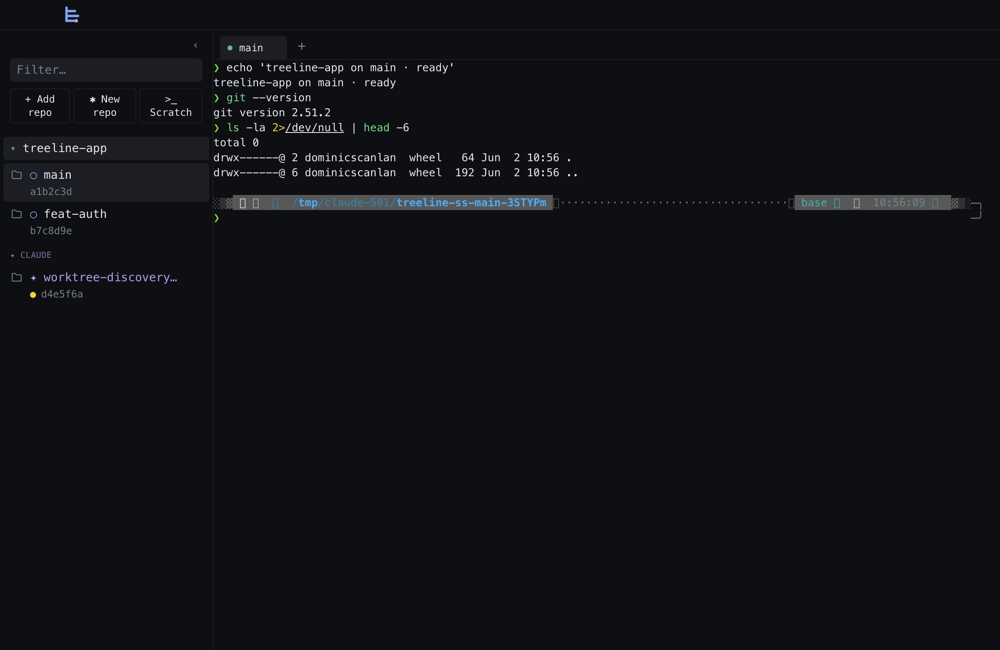
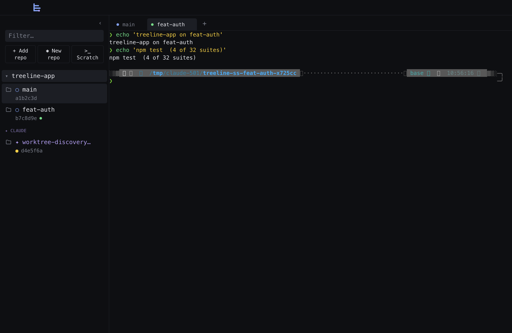
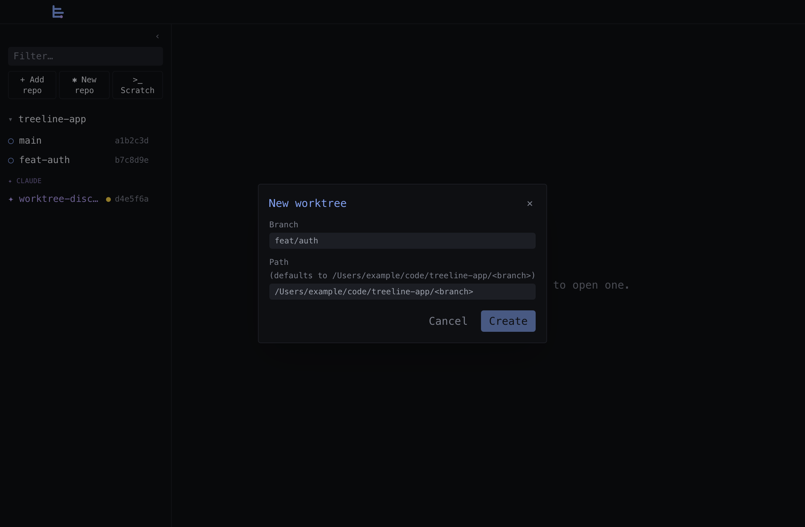
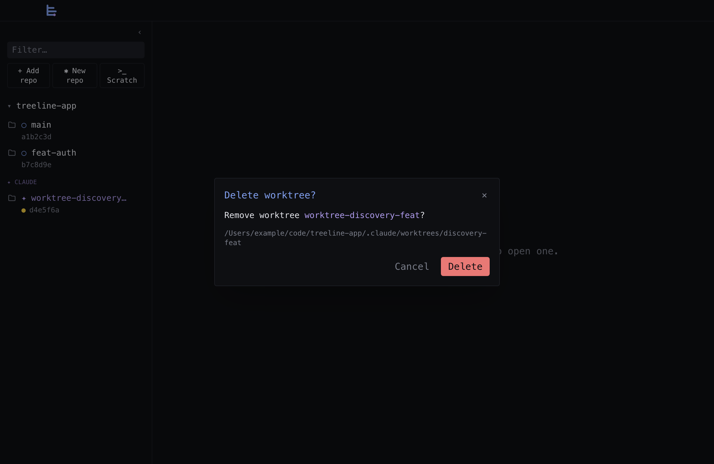

# treeline-app

A worktree-aware terminal multiplexer for macOS. One Electron window
contains both a sidebar of all your git worktrees across multiple repos
and the terminals you have open in them — so spawning Claude in a
worktree, watching `npm test` in another, and managing branches in a
third is one window, not three apps.

A reimagining of [`treeline`](../treeline) (the Rust TUI), but where the
Rust version drives an external iTerm2 via AppleScript, this version
**hosts** its own terminals via `node-pty` + `xterm.js`.


## Why

The driving workflow is:

1. Add a repo to the sidebar (one-time, via the native file picker).
2. Click the repo root → a terminal tab opens with a shell at the repo path.
3. Run `claude` in that tab — Claude creates a new git worktree.
4. The sidebar auto-refreshes (`fs.watch` on `.git/worktrees`) and the new
   worktree appears within ~500ms.
5. Click the new worktree → a tab opens cd'd into it. Or hit the `+`
   in the tab bar to add a second tab on the same worktree.

You can also work directly on a branch — clicking the repo root and
running `git`, `npm`, `vim` etc. is a first-class flow; the worktree
dance is optional.

## Status

v0.1.0 — feature-complete for v1: macOS only, repos managed manually,
tabs are session-only (no restore across launches).

## Install / run

```bash
git clone <this repo>
cd treeline-app
npm install              # also auto-rebuilds node-pty against Electron's ABI
npm run dev              # launches the app with HMR for the renderer
```

For a packaged build (.dmg + .zip, both arm64 and x64):

```bash
npm run package:mac
open release/mac-arm64/treeline-app.app   # control-click → Open the first
                                          # time; the build is unsigned
```

For a quick demo with pre-loaded fixture repos:

```bash
./scripts/launch-with-test-scenario.sh
```

This creates three pretend projects with multiple worktrees (some dirty,
some Claude-style), launches the dev build pointed at them, and cleans
up on exit.

## Tour

### Sidebar


| Action                          | Where                                                   |
| ------------------------------- | ------------------------------------------------------- |
| Add a repo                      | `+ Add repo` button (native picker)                    |
| Filter worktrees by branch/path | `Filter…` input above the repo list                    |
| Open repo root in a new tab     | `>_` icon on hover (next to the repo name)             |
| Create a worktree               | `+` icon on hover (next to the repo name)              |
| Remove a repo from the sidebar  | `×` icon on hover (the repo's data is untouched)       |
| Delete a worktree               | `×` icon on hover (next to a worktree row)             |
| Collapse/expand the sidebar     | `‹` / `›` button in the title bar, or `⌘B`             |

Each worktree row shows: the branch name, short SHA, a yellow `●` if the
working tree is dirty, a colored status dot for any open tabs on that
path (green = running, cyan = idle, dim = exited), and a magenta `claude`
/ `opencode` / `aider` badge if one of those CLIs is currently in that
worktree.

Claude-managed worktrees (paths under `.claude/worktrees/` or branches
starting with `worktree-`) get a magenta `✦` icon and are grouped into
their own `✦ Claude` sub-section per repo, mirroring the Rust TUI's
visual treatment.

### Terminals



Terminals are real PTYs spawned in the main process via `node-pty` and
rendered with `xterm.js` (WebGL renderer, FitAddon, WebLinks, Search).

- **Click a worktree** → focus the most-recently-used tab for that path,
  or open one if none exists.
- **Click `+` in the tab bar** → open an *additional* tab on the
  selected sidebar item, even if one already exists. Useful for keeping
  one tab running `claude` and another tab on the same repo for actual
  work.

  

- **Click the `>_` icon on a repo node** → opens a fresh tab at the
  repo root. Same as `+` but doesn't require selecting first.
- **Click a tab's `×`** → closes the tab, kills its PTY (SIGHUP, then
  SIGKILL after 200 ms), and falls back to the next-MRU tab on the same
  worktree if any.

Terminals stay mounted (consuming PTY data into their scrollback) when
not visible, so switching back is instant — no replay flicker.

### Create / delete worktrees



The create dialog auto-fills the path as `<repo>/<branch>`. If the
branch already exists, the underlying git call falls back to
`git worktree add <path> <branch>` (no `-b`), so re-creating a worktree
after deleting its directory just works.



The delete dialog warns you about open tabs that will close, then runs
`git worktree remove --force <path>`. Tabs are closed before the path
disappears so xterm doesn't keep talking to a vanished cwd.

### Sidebar collapse


`⌘B` (or the `‹` button in the title bar) hides the sidebar entirely.
The terminal re-fits to the new width on the next animation frame.
Collapse state persists across launches via the app config.

## Keyboard shortcuts

| Shortcut | Action                       |
| -------- | ---------------------------- |
| `⌘B`     | Toggle sidebar               |
| `⌘W`     | Close active window          |
| `⌘Q`     | Quit (kills all PTYs)        |
| `⌘R`     | Reload renderer (dev)        |

xterm captures everything else and forwards it to the PTY, so editor
shortcuts, ⌃C, vim modes, etc. all work as you'd expect inside a tab.

## Architecture

See [docs/ARCHITECTURE.md](docs/ARCHITECTURE.md) for the long version.
The short version:

```
┌────────────────────────────────────────────────────────────────────┐
│                         Renderer (React + Zustand)                 │
│                                                                    │
│   <Sidebar>            <TabBar>             <TerminalView>×N       │
│   <Modals>             <TitleBar>           hooks/useXterm         │
│        │                   │                       │               │
│        └────── window.treeline (contextBridge) ────┘               │
└────────────────────────────────────────────────────────────────────┘
                                ▲
                        ipcMain ▾ ipcRenderer
                                ▼
┌────────────────────────────────────────────────────────────────────┐
│                        Main (Electron + Node)                      │
│                                                                    │
│   PtyManager (node-pty)         WorktreeWatcher (fs.watch + 5s)    │
│   TerminalStatusMonitor (1 s)   ProcessMonitor (2 s, ps + lsof)    │
│   ReposStore (atomic JSON)      git.ts / git-porcelain.ts          │
└────────────────────────────────────────────────────────────────────┘
```

- **`src/shared/`** — types and the IPC contract; pure, used by both sides.
- **`src/main/`** — privileged work: spawning shells, running git,
  watching the filesystem, polling the process table.
- **`src/preload/index.ts`** — single contextBridge that exposes
  `window.treeline.{repos, worktrees, pty, processes, terminalStatus, config, window}`.
- **`src/renderer/`** — React UI; gets data from main only via the
  preload bridge. `contextIsolation: true`, `nodeIntegration: false`,
  `sandbox: true`.

## Testing

```bash
npm test              # vitest, ~62 tests across 7 suites
npm run typecheck     # strict tsc on main + renderer
npm run lint
```

The suites:

| Suite                | Coverage                                                |
| -------------------- | ------------------------------------------------------- |
| `claude-detect`      | `.claude/worktrees/` paths and `worktree-*` branches    |
| `git-porcelain`      | The `git worktree list --porcelain` parser              |
| `git`                | Real-temp-repo round-trips (list/create/remove/dirty)   |
| `repos-store`        | Atomic writes, schema migration, corrupt-file recovery  |
| `pty-manager`        | Chunk coalescing, SIGHUP→SIGKILL escalation             |
| `terminal-status`    | `running` / `idle` / `exited` deltas                    |
| `process-monitor`    | cputime parsing, longest-prefix attribution, idle ≥10 s |

Tests that touch git use `GIT_CONFIG_GLOBAL=/dev/null` so they don't
inherit your machine's commit-signing config (1Password, GPG, etc.).

## Development

See [docs/DEVELOPING.md](docs/DEVELOPING.md) for the full guide. The
quickstart:

```bash
npm run dev                       # main + preload + renderer with HMR
./scripts/launch-with-test-scenario.sh   # dev build with fixture repos
./scripts/take-screenshots.sh     # walks you through capturing README images
```

`postinstall` runs `electron-builder install-app-deps` automatically so
node-pty stays matched to Electron's ABI. If you ever see
`Module did not self-register`, that's the signal you skipped it.

## Layout

```
src/
├── shared/               # types + IPC contract (used by main and renderer)
│   ├── types.ts
│   ├── ipc-channels.ts
│   ├── ipc-contract.ts
│   └── claude-detect.ts
├── main/                 # privileged code; runs in Node
│   ├── index.ts          # whenReady wiring
│   ├── menu.ts           # macOS app menu (⌘B accelerator etc.)
│   ├── git.ts            # execFile wrappers around git CLI
│   ├── git-porcelain.ts  # pure parser of `git worktree list --porcelain`
│   ├── pty-manager.ts    # node-pty + chunk coalescing + SIGHUP→KILL
│   ├── process-monitor.ts        # 2 s ps + lsof scan; AI CLI detection
│   ├── terminal-status.ts        # 1 s tick; per-PTY foreground state
│   ├── worktree-watcher.ts       # fs.watch + 5 s poll fallback
│   ├── repos-store.ts            # atomic JSON config in app userData
│   ├── ipc/                      # one file per domain
│   └── util/             # exec, safe-path
├── preload/index.ts      # contextBridge surface
└── renderer/
    ├── App.tsx           # top-level layout
    ├── components/       # Sidebar, MainArea, TabBar, terminals, modals
    ├── store/            # Zustand: repos, tabs, processes, modal slices
    ├── hooks/useXterm.ts
    ├── ipc/client.ts     # subscribes IPC events into the store
    └── actions/tabs.ts   # focusOrOpen / closeTab
```

## Caveats

- **macOS only.** Linux/Windows are doable (node-pty + xterm.js are
  cross-platform) but the title bar, traffic-light gutter, and
  packaging config are mac-specific.
- **Unsigned packaged builds.** The DMG works but Gatekeeper will block
  on first launch (control-click → Open). Renew your Apple Developer
  cert and re-package once you want signed builds.
- **Tabs are session-only.** Quitting kills all PTYs. Repos and the
  sidebar collapse state persist; tab state does not.
- **`postcss.config.js` MODULE_TYPELESS_PACKAGE_JSON warning** is
  harmless. Setting `"type": "module"` on `package.json` would silence
  it but force renames elsewhere; not worth it for v1.
