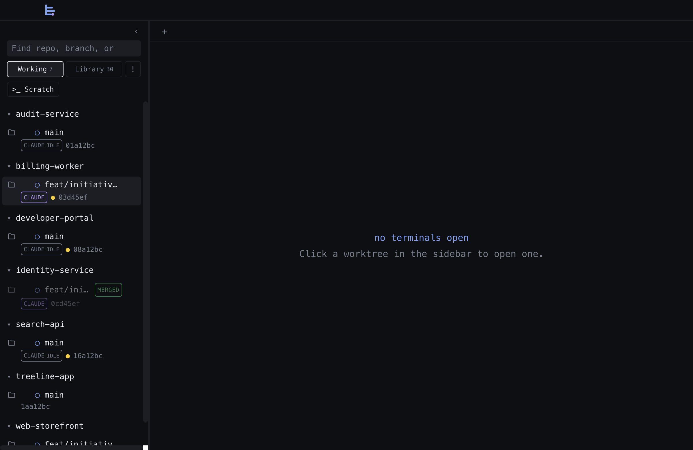
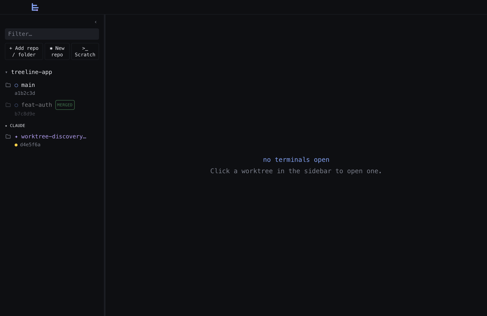
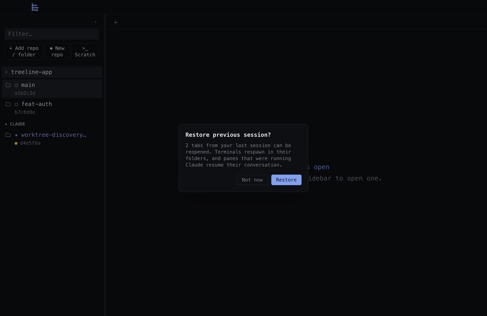
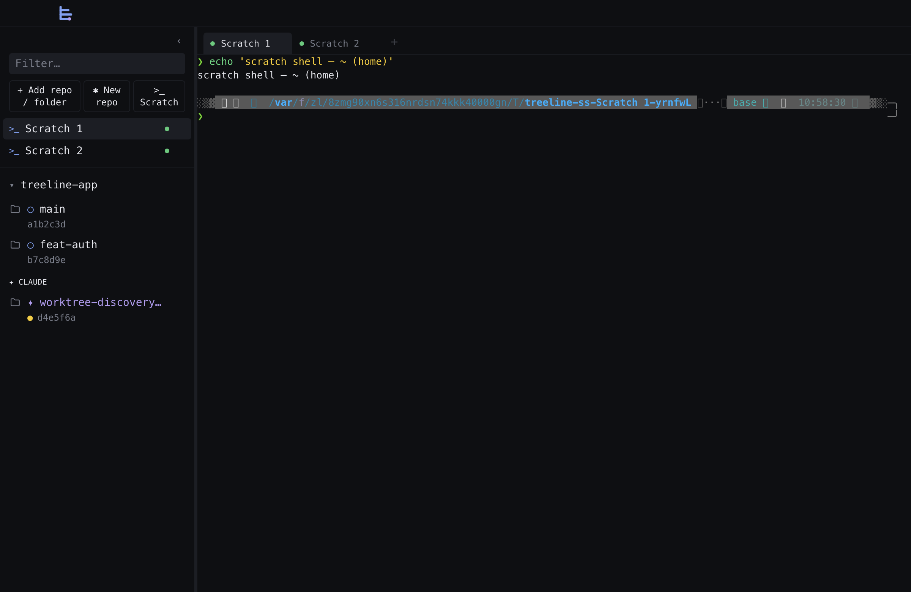
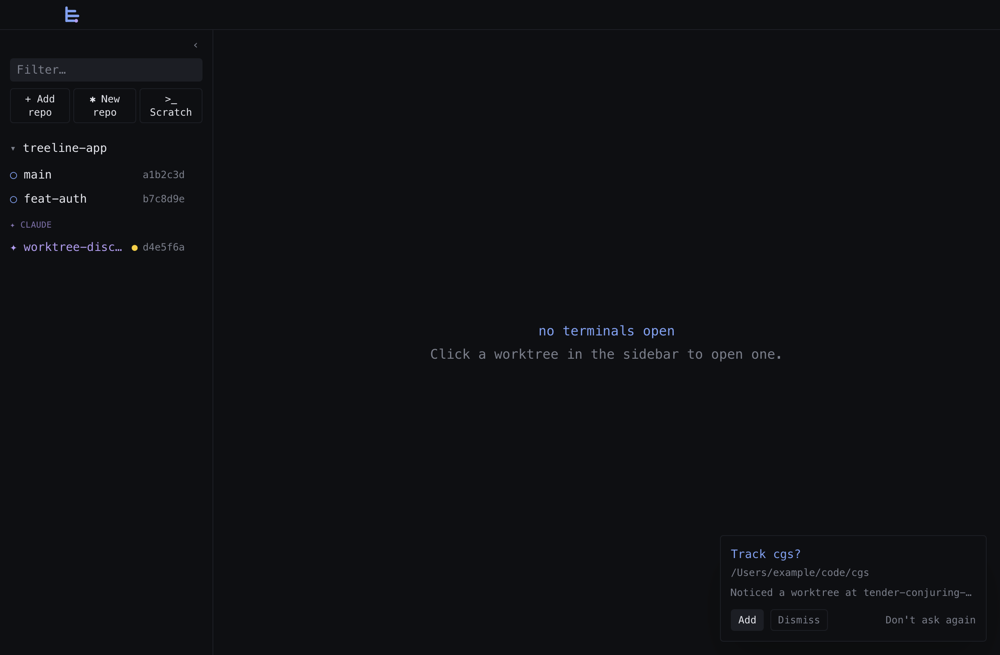
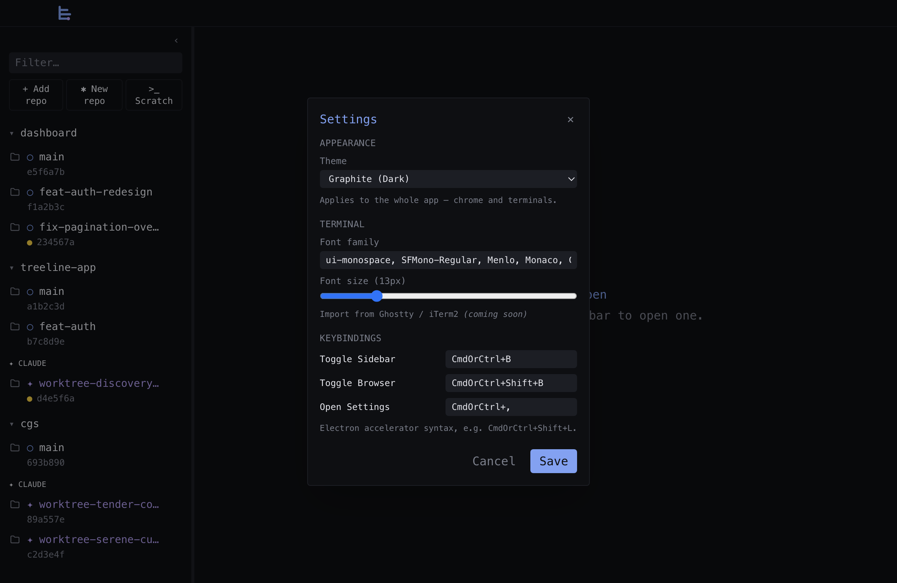

# Treeline User Guide

A task-oriented tour of the GUI. For installation and a high-level feature
overview see the [README](../README.md); for the scriptable CLI see
[CLI.md](./CLI.md).

---

## Five-minute quick start

1. **Add a repo.** Click **+ Add repo / folder** in the sidebar and pick a git
   repo with the native file picker. It appears in the sidebar with its
   worktrees.
2. **Open a terminal.** Hover the repo row and click its **`>_`** button — a
   terminal tab opens with a shell at the repo root. (Clicking the repo *name*
   just expands/collapses its worktrees.)
3. **Start a dev server.** Run your server in that terminal (`npm run dev`,
   etc.).
4. **View it.** A dim-cyan **`:PORT`** chip appears on the worktree row once the
   server is listening — **click it** to open `http://localhost:PORT` in the
   embedded browser pane. Or click the `http://localhost:…` URL your server
   prints in the terminal; it opens in the same pane (other URLs go to your OS
   browser).
5. **Look at changed files.** Click the **folder icon** on a worktree row,
   switch to the **Changed** tab, and click a file to open its diff beside the
   terminal. Click **Edit** + **⌘S** to edit and save.
6. **Work in a worktree.** Run `claude` (or `git worktree add`) in the repo-root
   terminal; the new worktree appears in the sidebar within ~500ms. Click it to
   open a tab cd'd into it.

---

## The sidebar

| Action | Where |
| ------ | ----- |
| Add an existing repo (or non-git folder) | **+ Add repo / folder** (native picker) |
| Create a new repo | **✱ New repo** (modal — `git init` in a new/empty folder) |
| Open a scratch terminal | **`>_ Scratch`** (shell in your home dir) |
| Show only open/running/pinned work | **Working** above the list |
| Browse every registered target | **Library** above the list |
| Find any repo, branch, path, or folder | **Find repos or branches…** (`/` or **⌘⇧O**) |
| Keep an inactive target in Working | **`☆`** on hover |
| Show dirty/merged/unread/failing work | **`!`** beside Working/Library |
| Open a repo root in a new tab | **`>_`** icon on hover (next to the repo name) |
| Create a worktree | **`+`** icon on hover (next to the repo name) |
| Browse a worktree's files | **folder** icon at the left of a worktree row |
| Remove a repo from the sidebar | **`×`** icon on hover (data on disk untouched) |
| Delete a worktree | **`×`** icon on hover (next to the worktree row) |
| Collapse/expand the sidebar | **`‹` / `›`** in the title bar, or **⌘B** |

**Working and Library.** Working is derived from open tabs, detected running
processes, and pinned targets, so a large repository catalog stays out of the
way during normal work. Library contains the complete catalog, grouped by parent
directory with repositories collapsed by default. Parent and repository
disclosure choices are remembered while browsing files, switching modes,
searching, and across app restarts. Searching is global: it finds inactive
Library targets even when Working is selected.

The folder button opens one focused Files view with a back button. This keeps
deep file trees out of the repo/worktree navigator; only one target's files are
shown at a time.

**Resizing the sidebar.** Drag the divider on the sidebar's right edge to widen
or narrow it. **Double-click the divider** to reset it to the default width.
(The divider is hidden while the sidebar is collapsed — the **⌘B** toggle is the
way back.)

Each worktree row shows: the branch name, short SHA, a yellow **`●`** if the
working tree is dirty, a status dot for any open tabs on that path (green =
running, cyan = idle, dim = exited), a magenta `claude`/`opencode`/`aider` badge
if one of those CLIs is in that worktree, a **`:PORT`** chip per listening port,
and a **`#NNN`** badge for the branch's linked GitHub PR.

A worktree whose branch has already been **merged into the default branch** is
greyed-out and tagged with a **`MERGED`** badge, so stale, safe-to-prune trees
stand out from active work at a glance.

Claude-managed worktrees (paths under `.claude/worktrees/` or branches starting
with `worktree-`) get a magenta **`✦`** and group into a **`✦ Claude`**
sub-section per repo.

---

## Terminals, tabs & splits

Terminals are real PTYs (`node-pty` + `xterm.js`).

- **Click a worktree** → focus the most-recently-used tab for that path, or open
  one if none exists.
- **Click `+` in the tab bar** → open an *additional* tab on the selected
  sidebar item, even if one already exists.
- **Click a repo's `>_`** → open a fresh tab at the repo root.
- **Drag a tab** along the tab strip to reorder it. A plain click still selects
  (the drag only engages past a small threshold).
- **Click a tab's `×`** → close the tab and kill its PTY.
- **Click a link in terminal output** → a local dev-server URL opens in the
  embedded browser pane; any other URL opens in your OS browser.

**Splits.** A tab is a *tree* of panes:

- **⌘D** splits the focused pane right; **⌘⇧D** splits it down.
- **⌘⌥ + arrows** move focus between panes (the focused pane has the cyan ring).
- **⌘⇧W** closes the focused pane and collapses the split.
- **Drag a divider** between panes to resize.

Tabs and panes stay mounted when hidden, so output keeps flowing and switching
back is instant.

---

## Your sessions survive a window reload

Your terminals live in treeline's background process, not in the window. So when
the **window reloads** (you hit Reload, ⌘R) treeline **re-adopts the terminals
that were still running** instead of leaving them orphaned. A brief
**"↻ Restored N terminals"** toast confirms it, and each pane repaints itself (a
long-running `claude` session, a watching `npm test`, that `ssh` you left open)
so you pick up where you left off.

What this means in practice:

- A reload **doesn't kill your running agents or commands** — they keep running
  and reappear in their tabs.
- You won't accumulate **invisible orphaned shells** eating resources behind a
  window that lost track of them.

Notes:

- Each surviving terminal comes back as its own tab. A split *layout* isn't
  restored on a reload — the panes return as separate tabs.
- Scrollback from before the reload isn't replayed; a running full-screen tool
  (like an agent CLI) repaints its current view, and a plain shell shows a fresh
  prompt. The **process and its state are intact** either way.
- A reload keeps the background process alive. When that process *ends* — an
  auto-update relaunch or a reboot — see the next section.

---

## Your tabs come back after a full restart

A reload keeps the background process running, so treeline can re-adopt the live
shells. A **full restart doesn't** — when the app **auto-updates and relaunches**
or your **machine reboots**, that process ends and the shells are gone for good.
For that, treeline saves your **tab layout to disk** and offers it back on the
next launch.

On a cold start with a saved layout you'll see a **"Restore previous session?"**
prompt. Nothing happens until you choose:

- **Restore** rebuilds the session — a fresh terminal in each tab's folder, with
  the **split layout** exactly as you left it (not flattened into separate tabs
  like a reload), and any pane that was running **Claude** resumes its
  conversation automatically. A **"↻ Restored N tabs"** toast confirms it.
- **Not now** starts clean and forgets that saved layout.

Good to know:

- This is the case the reload-reattach **can't** cover: an auto-update or a
  reboot kills every shell, so treeline respawns fresh ones from the saved
  layout rather than re-adopting the originals.
- A tab whose worktree you **deleted** while the app was closed is skipped, and
  the toast tells you how many were skipped.
- As with a reload, scrollback isn't replayed — a respawned shell starts at a
  clean prompt, and a resumed Claude pane repaints its current view.
- **Scratch terminals** come back too: each restored scratch reappears in the
  **`>_ Scratch`** sidebar group with its original label (`Scratch 1`, `Scratch 2`,
  …), and numbering stays dense — the next one you open takes the lowest free
  number rather than colliding with a restored row. Typing `exit` (or closing
  the tab) tears the row down just like a freshly opened scratch.

---

## Knowing when an agent needs you

When an agent (Claude Code, or any tool) running in a terminal wants your
attention — it finished a task, or it's asking a question or for permission —
treeline surfaces it so you don't have to babysit every pane:

- The **tab** turns into a pulsing magenta *waiting* tab.
- That worktree's **sidebar row** gets a magenta unread dot.
- The **pane** itself gets a magenta ring with a short message.
- If the window is in the background, you also get a **native macOS notification**
  (click it to focus the app).

The signal clears the instant you focus the pane — click it, switch to its tab,
or jump to it.

**Jump to the waiting agent.** Press **⌘⇧U** (*View → Jump to Unread Agent*) to
focus the most-recently-waiting pane, wherever it is. Like every shortcut, it's
rebindable in [Settings](#settings--theming).

**How treeline learns an agent is waiting** — two complementary paths:

1. **Terminal escape codes.** Any program that emits an OSC&nbsp;9 / 99 / 777
   desktop-notification sequence lights the pane it ran in. Nothing to set up.
2. **Agent hooks.** Claude Code and codex don't emit those codes themselves,
   so run `treeline hooks setup` once (Claude Code; see the
   [CLI guide](./CLI.md#agent-hooks)) or `treeline hooks setup --agent codex`.
   It wires the agent's own notification mechanism (Claude Code's *Stop* /
   *Notification* hooks; codex's `notify` config) to treeline, which maps
   events back to the exact pane the agent is running in. aider has no hook
   system — path 1 covers it if your setup emits the escape codes.

---

## Dev servers & the browser pane

When a server, test runner, or preview starts listening inside a worktree, a
**`:PORT`** chip appears on that row (attributed by the listener's cwd, so even
a server you launched outside treeline shows up).

- **Click a `:PORT` chip** → opens `http://localhost:PORT` in the embedded
  browser pane.
- **Toggle the pane** any time with **⌘⇧B** (or **View → Toggle Browser**).

The pane is real Chromium (an Electron `<webview>` with its own isolated
session), with an address bar, back/forward/reload, and a draggable divider. A
bare host typed in the address bar is assumed `http://`, and `file://` URLs open
local HTML (build output, coverage reports, generated pages); other non-web
schemes (`javascript:`, `data:`, `chrome:`) are refused. Links that try to open a
new window go to your OS browser. The pane is also scriptable from the
[CLI](./CLI.md#browser-verbs), though acting (eval/click/fill) stays
localhost-only — a `file://` page can be viewed but not scripted.

---

## Scratchpad

Press **⌘⇧N** (or **View → Toggle Scratchpad**) to open a **scratchpad** beside the
terminal — a single plain-text buffer for the quick **paste → clean → copy** loop.
Drop a messy block an agent printed, delete the lines you don't want, and **Copy**
the clean result into another chat, without opening a separate editor.

- **Copy** (header) puts the whole buffer on the clipboard; **Clear** wipes it — click
  it again to confirm, since it deletes saved content. `×` closes the panel.
- **Drag the divider** on the left edge to resize; the terminal re-fits.
- The text **persists** — it's restored after a reload or a full restart (saved as you
  type, on blur, and on window close).
- The scratchpad and the [browser pane](#dev-servers--the-browser-pane) share the
  right-hand slot, so opening one closes the other.

---

## Reading & editing files

Click the **folder icon** on a worktree row to expand its file tree.

- **Refreshing a folder.** The **All** tree lists a folder's contents each time you
  expand it. If you add or remove files in a folder that's already open, collapse and
  re-expand it to pick up the change.
- **All | Changed toggle.** **Changed** swaps the tree for a flat list of the
  worktree's working-tree changes, each tagged with a colored status letter:

  | Letter | Meaning | Color |
  | ------ | ------- | ----- |
  | `M` | modified | yellow |
  | `A` | added | green |
  | `?` | untracked | green |
  | `D` | deleted | red |
  | `R` | renamed | cyan |
  | `U` | conflicted | red |

  Deleted entries are struck-through and not clickable. Brand-new untracked
  directories aren't collapsed into one inert row — their individual files are
  listed (each opens as an all-additions diff), the same way VS Code does it.
- **Click a file** → opens read-only and syntax-highlighted, splitting in beside
  the terminal. Clicking a file in **Changed** opens its **diff** (working tree
  vs `HEAD`); a **`Diff | File`** toggle flips between them.
- **Markdown** files open on a rendered **Preview** (`Preview | Diff | File`).
- **Notes & wikilinks.** The Preview understands wiki-style markdown notes
  (the format used by Obsidian, Logseq, and similar apps — but any folder of
  markdown works):
  `[[wikilinks]]` (including `[[note|alias]]` and `[[note#heading]]`) render as
  links and open the target note **in the same panel** — resolved by filename
  within the containing vault. Relative markdown links (`[text](other.md)`)
  also open in-panel; regular `https://` links still open in your OS browser.
  Following a note link shows a **breadcrumb trail** under the panel header —
  a **←** back button plus one clickable crumb per note you hopped from;
  clicking a crumb jumps back and truncates the trail browser-style. The trail
  only tracks link navigation: opening any file fresh (tree, quick-open,
  search) or closing the panel clears it.
  A link whose target doesn't exist renders dimmed with a "Note not found"
  tooltip. YAML frontmatter is shown as a compact properties table instead of
  raw `---` fences. By default the "vault" is the pinned repo/folder containing
  the note; set an explicit vault root under **Settings → Notes** if your vault
  lives inside a larger repo. (Notes hidden by `.gitignore` aren't indexed, so
  links to them show as not found.)
- **Editing.** Click **Edit**, change the file, and save with **⌘S** (an amber
  dot marks unsaved changes; writes are atomic). Navigating away with unsaved
  edits prompts first.

Files over 1 MB are shown truncated; binary files show a placeholder.

### Non-git folders

**+ Add repo / folder** also accepts plain directories (dotfiles, a notes dir,
`~/.claude/commands`). A non-git folder is pinned as a top-level node with the
same editable file tree — but no worktrees and no **Changed**/diff view (those
are git-only). Editing existing files only; creating new files from the tree
isn't supported yet. Clicking the folder row **selects** it (highlighted), which
makes it the scope for ⌘⇧P quick-open and ⌘⇧F find-in-files — handy for a
notes vault.

---

## Searching your code

Two ways to find things, both **scoped to one worktree or folder** — whichever
is selected in the sidebar (if nothing is selected, treeline falls back to the
focused terminal's working directory). Both respect `.gitignore` and work in git
repos *and* plain non-git folders.

- **Go to a file by name — ⌘⇧P** (*View → Quick Open File…*). A fuzzy file
  finder: start typing any part of a path and the list narrows as you go
  (matched characters are highlighted). **↑ / ↓** move the selection, **Enter**
  opens the file in the code panel, **Esc** closes. Great for jumping straight to
  a file without expanding the tree.

- **Search file contents — ⌘⇧F** (*View → Find in Files…*). Opens a results panel
  on the right. Type a query and matches appear grouped by file as you type, each
  row showing the line number and the matching line with the hit highlighted.
  **Click any result** to open that file in the code panel **scrolled to — and
  with — that line selected**.

  Three toggles refine the search:

  | Button | Meaning |
  | ------ | ------- |
  | `Aa` | match case (off = smart-case) |
  | `ab` | match whole words only |
  | `.*` | treat the query as a regular expression (off = literal text) |

Both shortcuts are **rebindable** under *Settings → Keybindings* if they clash
with your habits.

---

## Creating repos & scratch terminals

**Create a new repo.** Click **✱ New repo** to skip `mkdir && git init`: choose
new-vs-existing folder, location, and initial branch; treeline runs `git init`,
registers the repo, and drops you into a terminal at the root.

**Scratch terminals.** Click **`>_ Scratch`** for a shell not tied to any repo
(spawns in your home dir, pinned above the repo list as `Scratch 1`, `Scratch 2`,
…). They're ephemeral — closing the tab or quitting the app drops them.

---

## Automatic repository discovery

If a terminal's working directory moves into a git repo that **isn't** tracked
yet, treeline surfaces a toast in the bottom-right offering to track it. (This
applies to any PTY cwd change — `cd`-ing in a scratch terminal, a Claude
worktree path, etc.)

The toast has three actions:

- **Add** — persists the repo to your sidebar and loads its worktrees (and parks
  focus on it so you can click straight through).
- **Dismiss** — suppresses it **for this session only**; it can re-prompt on the
  next launch if you land inside the repo again.
- **Don't ask again** — suppresses it **persistently** (recorded so it won't
  prompt for that path in future).

Multiple discoveries **queue**: the toast shows the first with a **`+N more`**
counter, and the next appears as you clear each one.

---

## Settings & theming

Open **Settings** with **⌘,** (or **treeline → Settings…**). Three sections:

- **Appearance — theme.** Pick a preset (**Graphite Dark**, **Graphite Light**,
  **Midnight**). The theme repaints the whole app *and* re-themes the live xterm
  instances — no reload.
- **Terminal — font.** Set the monospace font family and size (the whole app
  renders in it).
- **Keybindings.** Rebind the app's accelerators; conflicts and reserved system
  shortcuts are validated inline and block **Save** until fixed.

---

## Keeping the app up to date

Packaged (signed) builds update themselves:

- They **check at launch and every 4 hours**.
- When an update is found, treeline **asks before downloading** it.
- After the download finishes, it **offers to restart** to install (otherwise it
  installs on next quit).
- You can check on demand any time via **Treeline → Check for Updates…**.

(Auto-update only applies to packaged builds, not a `npm run dev` session.)
